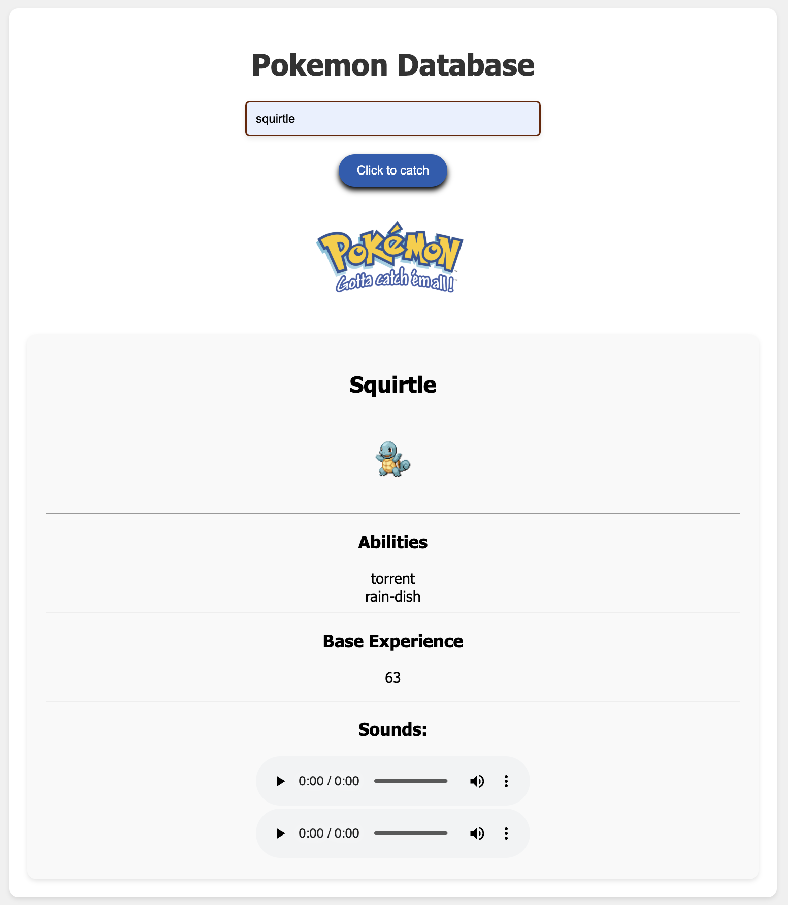

# PokéAPI Project

## Table of Contents

- [PokéAPI Project](#pokéapi-project)
  - [Table of Contents](#table-of-contents)
  - [Introduction](#introduction)
  - [Features](#features)
  - [Installation](#installation)
  - [Authors](#authors)
  - [Screenshots](#screenshots)
    - [Poké Stats Page](#poké-stats-page)

---

## Introduction

The PokéAPI Project is a simple web application that allows users to search for Pokémon by name and retrieve detailed information about them. The app fetches data from the [PokéAPI](https://pokeapi.co/) and displays it dynamically on the webpage. This project is designed to demonstrate the integration of APIs with HTML and JavaScript.

---

## Features

- **HTML Components**:

  - A clean and responsive design using a combination of HTML and CSS.
  - Input field for entering the Pokémon name.
  - A styled button to submit the search query.
  - A section to display Pokémon details dynamically.

- **JavaScript Features**:
  - Fetching Pokémon data from the PokéAPI using `fetch`.
  - Dynamic rendering of Pokémon details such as name, image, abilities, base experience, and sounds.
  - Error handling for invalid Pokémon names or failed API requests.

---

## Installation

1. **Clone the Repository**:
   ```sh
   git clone https://github.com/jenplanque/PokeAPI_Practice.git
   ```
2. **Navigate to the Project Directory**:
   ```sh
   cd PokeAPI_Practice
   ```
3. **Open the Project in a Web Browser**:
   - Open `index.html` in your preferred web browser.

## Authors

- **Jen Planque**: [GitHub Profile](https://github.com/jenplanque)

## Screenshots

### Poké Stats Page


